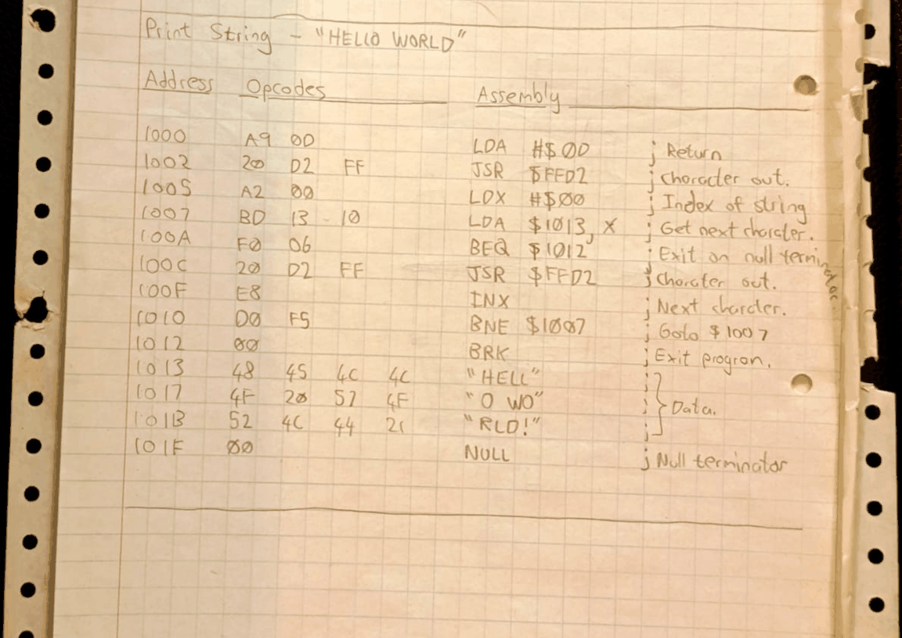
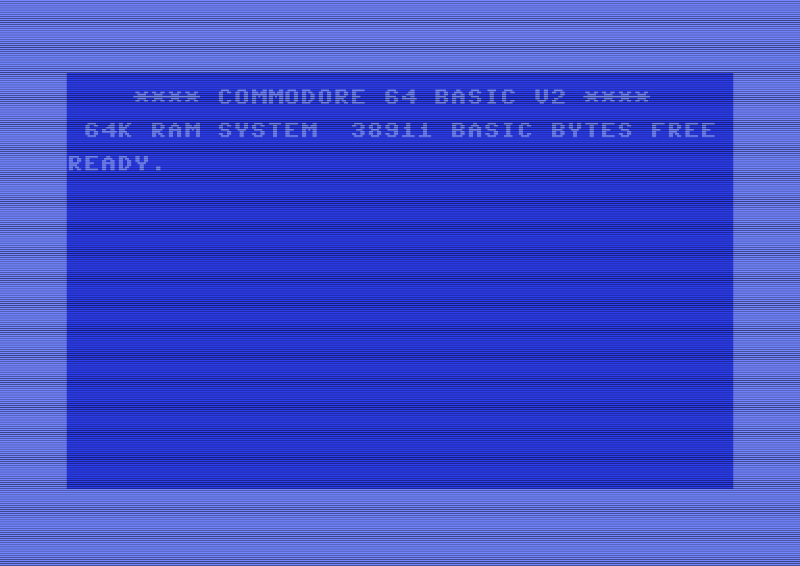

# Code Probe (Commodore 64)


<p align="center">
  &emsp;
  
</p>

A machine language monitor for the Commodore 64. Loads at `$C000` on a stock C64 — no cartridge or memory expansion required.

- Inspect and modify memory with a hex dump and interactive alter mode.
- View and modify the CPU registers and processor status flags via a shadow-register block; capture the live CPU state when a user routine returns through `BRK`.
- Fill and copy arbitrary blocks of memory.
- Save and load machine language programs to and from disk, in PRG and SEQ formats; list directories.
- Clear the screen and exit cleanly back to BASIC.

<br>

> *See Commodore VIC-20 version, [here](https://github.com/rohingosling/code-probe-vic-20).*

## 📑 Contents

- [🔎 Overview](#-overview)
- [🚀 Quick Start](#-quick-start)
- [📜 Version History](#-version-history)
- [💾 Loading and Starting](#-loading-and-starting)
- [📝 Command Reference](#-command-reference)
- [🎬 Example Session](#-example-session)
- [📂 Project Structure](#-project-structure)
- [💻 Building From Source](#-building-from-source)
- [💿 Disk Image Listing](#-disk-image-listing)
- [❓ FAQ](#-faq)
- [🤝 Contributing](#-contributing)
- [🙋‍♂️ Acknowledgements](#-acknowledgements)
- [📄 License](#-license)

## 🔎 Overview

Code Probe is a software-based machine language monitor that runs at the upper-RAM window `$C000-$CFFF` on a stock Commodore 64. The address range is permanent RAM, sitting between BASIC ROM (which ends at `$BFFF`) and the I/O page (which starts at `$D000`), so the monitor coexists with both ROMs in their default banked-in configuration.

The design of Code Probe was inspired by the DOS `DEBUG` utility and presents a similar terminal-style user interface and commands. All numeric input is hexadecimal: addresses are 4 digits; byte values, file types, and device numbers are 2 digits each.

### Memory Map

```
┌──────────────┬────────────────────────────────────────────────────┐
│ $E000-$FFFF  │   KERNAL ROM                                       │
│ $D000-$DFFF  │   I/O page (VIC-II, SID, CIA, color RAM)           │
│ $C000-$CFFF  │ ► Code Probe (4 KiB)                               │
│ $A000-$BFFF  │   BASIC ROM                                        │
│ $0800-$9FFF  │   BASIC program + free RAM (PRG load at $0801)     │
│ $0200-$07FF  │   System workspace + screen RAM ($0400-$07FF)      │
│ $0000-$01FF  │   Zero page + stack                                │
└──────────────┴────────────────────────────────────────────────────┘
```

The `$C000-$CFFF` window is permanent RAM that sits between BASIC ROM and the I/O page in the C64's default banking, so Code Probe coexists with both ROMs without any banking gymnastics. User machine language programs can live anywhere in the free RAM below BASIC ROM (typically loaded to `$0801` or higher).

### Features

- **Memory inspection** - Hex dump with PETSCII character display.
- **Memory editing** - Interactive alter mode with cursor navigation, auto-space between bytes, and auto-commit at ten bytes per line.
- **Register management** - View and modify A, X, Y, SP, PC, P, IO; expand the processor status flags as individual bits with `RF`. The shadow registers persist across `G` invocations.
- **Memory operations** - Fill ranges with a constant byte, copy ranges with overlap-safe forward and backward walks; clamp at `$FFFF` with an overflow warning.
- **Program execution** - Run machine language programs via an RTI dispatch with the shadow registers loaded into the live CPU; the user routine returns to the monitor with `BRK`, and CPU state is captured back into the shadow block.
- **Disk I/O** - Save and load PRG and SEQ files to and from a 1541 (or compatible) disk drive at device 8; list directories. PRG files round-trip with a chosen load address; SEQ files carry raw bytes only.
- **Screen control** - Clear the display with a single command.
- **Exit to BASIC** - Return to BASIC's `READY.` prompt; re-enter Code Probe with `SYS 49152`.

## 🚀 Quick Start

```
LOAD "CODEPROBE",8,1
SYS 49152
```

```
CODE PROBE (2.1) - ROHIN GOSLING

: █
```


The first two lines load Code Probe from a 1541-compatible drive at device 8 and start it. The third — your first command — dumps the first 256 bytes of the monitor's own code, so you can confirm it's running.

See the [Command Reference](#command-reference) for the full command set, [Loading and Starting](#loading-and-starting) for VICE and SD2IEC variants, or [`docs/user-manual.pdf`](docs/user-manual.pdf) for worked tutorials.

## 📜 Version History

| Year | Version | Platform   | Description                                                             |
|------|---------|--------|-------------------------------------------------------------------------|
| 1988 | 1.0     | VIC-20 | Hand-assembled and poked into RAM with a BASIC machine language loader. |
| 1990 | 2.0     | C64    | Ported to C64, with expanded feature set and C64-specific updates.        |
| 2026 | 1.1     | VIC-20 | Assembly reconstruction of original version 1.0 for the VIC-20.         |
| 2026 | 2.1     | C64    | Assembly reconstruction of version 2.0 for the C64.                     |

## 💾 Loading and Starting

Code Probe loads at address `$C000` (49152 decimal) and occupies up to 4 KiB of RAM in the `$C000-$CFFF` region. The native C64 RAM at `$0801-$BFFF` (BASIC's program area + free RAM up to BASIC ROM) is left free for user machine language programs.

### From Disk

```
LOAD "CODEPROBE",8,1
SYS 49152
```

The `,8,1` parameter loads the program to the address stored in its PRG header (`$C000`), rather than to the default BASIC area. `SYS 49152` transfers control to Code Probe.

### From the VICE Emulator

To launch `x64sc` with `build/codeprobe.prg` autostarted into the monitor:

```bash
x64sc -autostart build/codeprobe.prg
```

To attach a disk image at the same time so save and load can target it:

```bash
x64sc -8 dist/codeprobe.d64 -autostart build/codeprobe.prg
```

`x64sc` must be on `PATH`, or substitute the full path to your VICE install (e.g. `C:\Programs\GTK3VICE-3.10-win64\bin\x64sc.exe` on Windows, `/usr/bin/x64sc` on most Linux distributions).

### What Happens at Startup

1. The screen border and background are set to black via VIC-II registers `$D020` and `$D021`.
2. The KERNAL text colour at `$0286` is set to green.
3. The screen is cleared via `CHROUT $93`.
4. The title banner is displayed.
5. A blank line separates the banner from the first prompt.
6. The shadow registers are initialised to their defaults.
7. The original BRK vector at `$0316/$0317` is saved, and Code Probe's `brk_handler` is patched in.
8. The monitor prompt loop begins.


## 📝 Command Reference

All address and count values are hexadecimal: addresses are 4 digits; byte values and device numbers are 2 digits each. Filenames are enclosed in double quotes and limited to 16 characters of uppercase PETSCII.

| Command | Syntax                                              | Description                                              |
|---------|-----------------------------------------------------|----------------------------------------------------------|
| `A`     | `A <address>`                                       | Enter alter mode to write hex bytes to RAM.              |
| `D`     | `D <start> <end>`                                   | Hex dump memory from start to end (inclusive).           |
| `R`     | `R`                                                 | Display A, X, Y, SP, PC, P, IO from the shadow block.    |
| `R`     | `R <register> <value>`                              | Set a shadow register and reprint the line.              |
| `RF`    | `RF`                                                | Display registers + flag bit-view.                       |
| `RF`    | `RF <flag> <bit>`                                   | Set a processor status flag and reprint.                 |
| `F`     | `F <address> <count> <value>`                       | Fill memory range with a byte. Clamps at $FFFF.          |
| `T`     | `T <source> <count> <destination>`                  | Copy memory range to a destination. Overlap-safe.        |
| `G`     | `G <address>`                                       | Execute machine code at address; capture regs on BRK.    |
| `S`     | `S "<file>" <device> <start> <end> [<load_addr>]`   | Save range to file. With load_addr = PRG; without = SEQ. |
| `L`     | `L <device>`                                        | List files on device.                                    |
| `L`     | `L "<file>" <device>`                               | Load PRG file (uses file's load address).                |
| `L`     | `L "<file>" <device> <address>`                     | Load SEQ / raw bytes to specified address.               |
| `CLS`   | `CLS`                                               | Clear the screen.                                        |
| `EXIT`  | `EXIT`                                              | Exit to BASIC. Re-enter with `SYS 49152`.                |

The `S` and `L` commands take filenames in `"<name>"` form because the 1541 disk drive uses unquoted commas to separate the filename from its type and mode flags. Code Probe builds those flags internally (`,P,W` for PRG save, `,S,W` for SEQ save), so the user's filename has to be quoted to disambiguate.

The `G` command builds an RTI stack frame from the shadow registers and dispatches into the user routine via `RTI` (not `JSR`). The user routine **must** terminate with `BRK` (opcode `$00`) to return to Code Probe; an `RTS` will pull garbage off the stack. On BRK, the live CPU state is captured back into the shadow block, restoring the screen colours and dropping into the monitor prompt.

See [`docs/user-manual.pdf`](docs/user-manual.pdf) for the full user manual, including worked tutorials, the memory map, error messages, a quick reference card, and an appendix on launching Code Probe under VICE emulation.

## 🎬 Example Session

**A typical end-to-end session:** load a small machine language routine from disk, verify it landed correctly, patch a byte in place, run it, then inspect the captured CPU state.

| **BASIC** Command Workflow      | Description                         |
|---------------------------------|-------------------------------------|
| `LOAD "CODEPROBE", 8, 1`        | Load Code Probe from disk.          |
| `SYS 49152`                     | Run Code Probe.                     |

```
CODE PROBE (2.1) - ROHIN GOSLING

: █
```
| **Code Probe** Command Workflow | Description                                         |
|---------------------------------|-----------------------------------------------------|
| `L "HELLO" 08`                  | Load HELLO; lands at $1000 per its PRG header.      |
| `D 1000 100F`                   | Verify the routine landed.                          |
| `A 1004`                        | Patch a byte interactively; press RETURN to commit. |
| `G 1000`                        | Execute; the routine returns through BRK.           |
| `R`                             | Show captured A, X, Y, SP, PC, P, IO.               |
| `EXIT`                          | Return to BASIC's `READY.` prompt.                  |


`HELLO` is one of the demo programs on the distribution disk image (see [Disk Image Listing](#disk-image-listing)). It writes "`HELLO WORLD!`" to the screen and terminates with `BRK`, which hands control back to Code Probe and snapshots the live CPU registers into the shadow block where `R` can read them.

For deeper walkthroughs, including patching live code, writing machine language programs, fill-and-copy recipes, save/load round-trips, and shadow-register manipulation, see [`docs/user-manual.pdf`](docs/user-manual.pdf).

## 📂 Project Structure

The repository layout matches the released distribution exactly — what you see here is what ships in the GitHub release archive.

```
code-probe-c64/
├── LICENSE
├── README.md
├── build/
│   └── codeprobe.prg
├── dist/
│   └── code-probe-2.1.d64
├── docs/
│   └── user-manual.pdf
├── images/
│   ├── animation-1.gif
│   └── animation-2.gif
└── src/
    └── codeprobe.asm
```

`src/` holds the 6502 assembly source; `build/` the pre-built `.prg`; `dist/` the distribution disk image; `docs/` the rendered user manual; `images/` the demo GIFs and supporting images.

## 💻 Building From Source

Code Probe is a single-file assembly project built with [Kick Assembler](http://www.theweb.dk/KickAssembler/). Java is required.

**Assemble:**

```bash
java -jar KickAss.jar src/codeprobe.asm -odir build
```

or, on Windows, run the supplied driver:

```
build-code-probe.bat
```

The build produces `build/codeprobe.prg` — a PRG that loads at `$C000`. The same PRG runs on a physical Commodore 64 and on the VICE x64sc emulator.

### Running on a Physical Commodore 64

Hardware required:

- A Commodore 64 (PAL or NTSC).
- A means of transferring `build/codeprobe.prg` from the build host to the C64 — for example a 1541 / 1541-II disk drive with a PRG-to-D64 toolchain, an SD-card drive emulator (SD2IEC, Pi1541, Ultimate II), or a serial cable to a real 1541.

With the PRG on disk:

```
LOAD "CODEPROBE",8,1
SYS 49152
```

The `,8,1` parameter forces the file to load at the address in its PRG header (`$C000`) rather than the default BASIC program area at `$0801`. `SYS 49152` transfers control to the monitor.

### Running in VICE

```bash
x64sc -autostart build/codeprobe.prg
```

Run from the `v2/` directory so the relative path to `build/` resolves. `x64sc` must be on `PATH`, or substitute the full path to your VICE install (e.g. `C:\Programs\GTK3VICE-3.10-win64\bin\x64sc.exe` on Windows, `/usr/bin/x64sc` on most Linux distributions).

The supplied `run-code-probe.bat` (Windows) wraps the same launch with a sensible default install path.

## 💿 Disk Image Listing

Contents of the distribution disk image `dist/code-probe-2.1.d64`. The disk doubles as the binary release and a bundle of tutorial examples referenced from the user manual.

| File                                                                        | Type | Description                                                                                                                |
|-----------------------------------------------------------------------------|------|----------------------------------------------------------------------------------------------------------------------------|
| `CODEPROBE`&nbsp;                                                           | PRG  | Code Probe machine language monitor (v2.1). <br>Loads at `$C000`; invoke from BASIC with `SYS 49152`.                          |
| `CLS-ML`&nbsp;&nbsp;&nbsp;&nbsp;                                            | PRG  | Screen-clear utility (machine language). <br>Sets the border and background to black, the text colour to green, and clears the screen. |
| `CLS-BASIC`&nbsp;                                                           | PRG  | Screen-clear utility (BASIC). <br>Functionally identical to `CLS-ML`, but written in BASIC. <br>Provided as a side-by-side reference of the two languages. |
| `HELLO`&nbsp;&nbsp;&nbsp;&nbsp;&nbsp;                                       | PRG  | "Hello, world" demo intended to be loaded under Code Probe at `$1000` and executed with the `G` command. <br>Returns to the monitor via `BRK`. |
| `HELLO-RUN`&nbsp;                                                           | PRG  | Standalone "hello, world" with a BASIC autostart stub at `$0801` and an ML body at `$080E`. <br>`RUN` from BASIC with either `RUN` or `SYS 2062`. |
| [`CUBE-C64`](https://github.com/rohingosling/3d-cube-commodore)&nbsp;&nbsp; | PRG  | Interactive 3D rotating cube demo for the Commodore 64, ported from the original VIC-20 version. <br>BASIC autostart stub at `$0801`, ML body at `$080E`. <br>Used as a multi-KiB stress-test for Code Probe's Save / Load round-trip. |
| [`CUBE‑VIC20`](https://github.com/rohingosling/3d-cube-commodore)           | PRG  | Original VIC-20 version of the interactive 3D cube demo. <br>Included for cross-platform reference; it does not run on a C64. |

## ❓ FAQ

**Why must my routine end in `BRK` rather than `RTS`?**

The `G` command builds an `RTI` stack frame from the shadow registers and dispatches via `RTI`, not `JSR`. There is no return address on the stack for `RTS` to pull, so an `RTS` would pull garbage and jump into nowhere. `BRK` (opcode `$00`) traps into Code Probe's installed BRK handler, which is how the live CPU state is captured back into the shadow block.

**Why is all input hexadecimal?**

Hex matches how machine language is read in memory and in disassembly listings. Mixing hex and decimal would mean every numeric input needs a prefix or a modal switch, which adds friction. Sticking to hex keeps the prompt minimal and the parser simple — addresses are always 4 digits, byte values always 2.

**Does it work on both PAL and NTSC machines?**

Yes. Code Probe doesn't touch the VIC-II's raster or timing in a way that distinguishes the two video standards; it only writes the border, background, and text-colour registers, which behave identically on PAL and NTSC.

**Can I relocate Code Probe somewhere other than `$C000`?**

Not without rebuilding. The PRG header pins the load address to `$C000`, and `SYS 49152` depends on it. To relocate, change the load address in [`src/codeprobe.asm`](src/codeprobe.asm), reassemble with Kick Assembler, and update the `SYS` invocation accordingly. The `$C000-$CFFF` window is a particularly natural choice on a stock C64 because it's permanent RAM between two ROMs — see the [Memory Map](#memory-map) for context.

**Why does `G` capture registers via a shadow block instead of the live CPU?**

Two reasons. First, the shadow block lets you set the entry-point CPU state by typing `R A 5C` (etc.) before invoking `G` — there is no live CPU state to write to before the dispatch. Second, the shadow block survives further monitor commands; if `G` left the values in the live CPU, the very next instruction Code Probe ran would clobber them.

## 🤝 Contributing

Contributions are welcome. The recommended workflow:

1. Fork the [code-probe-c64](https://github.com/rohingosling/code-probe-c64) repository on GitHub.
2. Make your changes — source in `src/codeprobe.asm`, documentation under `docs/`.
3. Build locally with [Kick Assembler](http://www.theweb.dk/KickAssembler/) — see [Building From Source](#building-from-source).
4. Test on the VICE emulator, and on real hardware if you have access.
5. Open a pull request describing the change and what you tested.

## 🙋‍♂️ Acknowledgements

| Tool                                                       | Author&nbsp;/&nbsp;Maintainer | Role in this project                                                                                          |
|------------------------------------------------------------|-------------------------------|---------------------------------------------------------------------------------------------------------------|
| [Kick&nbsp;Assembler](http://www.theweb.dk/KickAssembler/) | Mads&nbsp;Nielsen             | 6502 cross-assembler. Builds `codeprobe.prg` from `codeprobe.asm`.                                            |
| [VICE](https://vice-emu.sourceforge.io/)                   | The&nbsp;VICE&nbsp;Team       | Commodore emulator suite. `xvic` and `x64sc` for development and testing.                                     |
| [C64&nbsp;TrueType](https://style64.org/c64-truetype)      | STYLE                         | TrueType C64 font set. Used to typeset the user manual in an authentic Commodore style.                       |
| [Claude&nbsp;Code](https://www.anthropic.com/claude-code)  | Anthropic                     | AI coding assistant. Constructed the Kick Assembler listings from the original PRG binaries.                  |

## 📄 License

Released under the [MIT License](LICENSE) — Copyright © 1990 Rohin Gosling.
